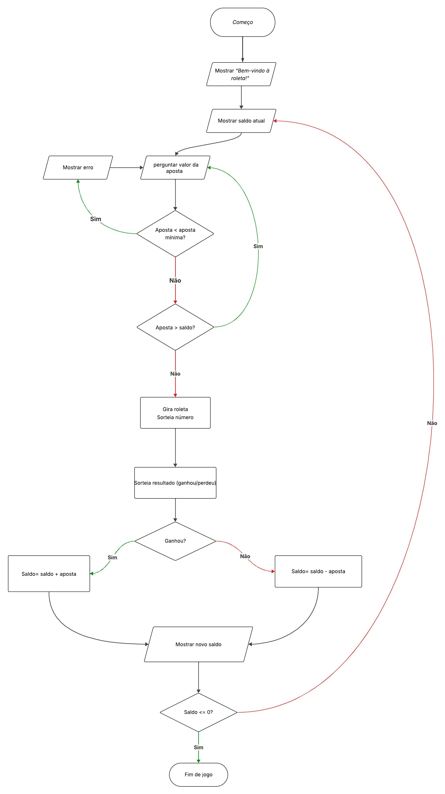

## Funcionamento do Jogo

O jogador começa com **R\$100**. Antes de cada rodada, ele escolhe um valor para apostar, respeitando a regra da **aposta mínima de R\$0,40**. Se tentar apostar mais do que tem em saldo, a jogada não acontece.

Depois da aposta, a roleta é girada. Ela traz um número aleatório de **1 a 5**, mas o que realmente importa é o desfecho: **ganhar ou perder**. O resultado é puramente aleatório. Se ganhar, o valor apostado é somado ao saldo; se perder, é descontado.

O jogo segue nesse ciclo: apostar, girar, ganhar ou perder. Isso continua até que o saldo do jogador chegue a **zero**, encerrando a partida.

## Fluxograma




## Comandos de Execução


### Comando 1
```git clone https://github.com/samuelmachadosenai/jogo-de-azar.git```

### Comando 2
```cd jogo-de-azar```

### Comando 3
```python main.py```


## Créditos

Açucena Pereira, Cauê Matos, Samuel Machado