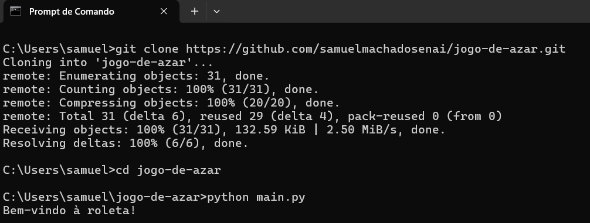

## Jogo da Roleta Par/ímpar

## Funcionamento do Jogo

O jogador começa com R$100. Antes de cada rodada, ele define quanto deseja apostar, sempre respeitando a aposta mínima de R$0,40. Se tentar apostar mais do que tem disponível no saldo, a jogada não acontece.
Depois da aposta, a roleta é girada. Ela gera aleatoriamente um número entre 1 e 15.

Se o número for par, o jogador vence a rodada e o valor apostado é adicionado ao saldo.

Se o número for ímpar, o jogador perde a rodada e o valor apostado é descontado do saldo.

O ciclo do jogo é simples e contínuo: apostar → girar → verificar resultado → atualizar saldo.
A partida só termina quando o saldo do jogador chega a zero.
    
      
        

## Fluxograma


  

## Comandos de Execução  
  

### Comando 1
```git clone https://github.com/samuelmachadosenai/jogo-de-azar.git```

### Comando 2
```cd jogo-de-azar```

### Comando 3
```python main.py```
  
    
      
        
## Resultado Esperado

Jogo funcionando perfeitamente.


    
      
        
          

## Créditos

Açucena Pereira, Cauê Matos, Samuel Machado